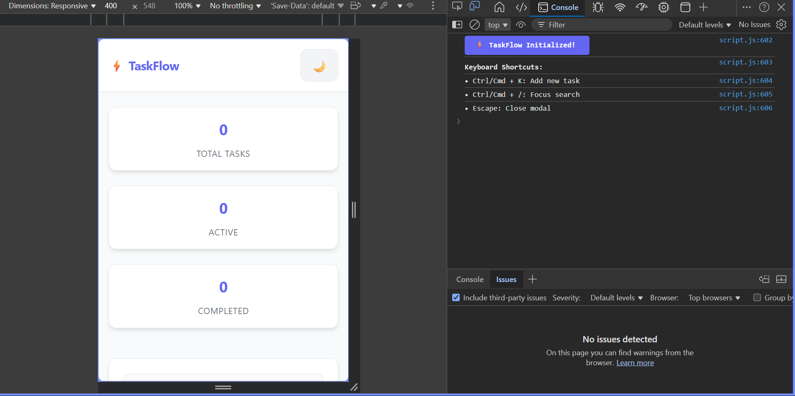
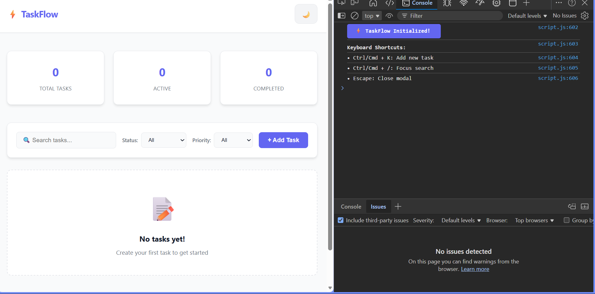
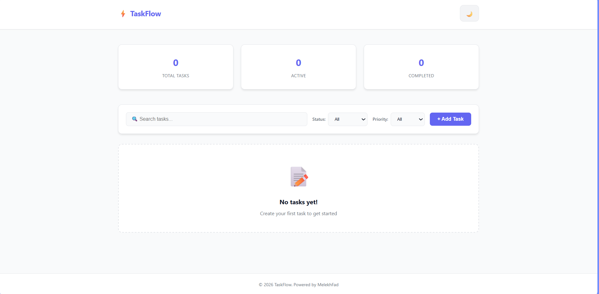

# ⚡ TaskFlow - Modern Task Manager

A complete, production-ready task management web application built with **HTML5**, **CSS3**, and **Vanilla JavaScript**. TaskFlow helps you organize, track, and complete your tasks with a beautiful, responsive interface.


## 🎯 Project Overview

**TaskFlow** is a fully-featured task manager that demonstrates mastery of web development fundamentals. Built as a final project showcasing HTML, CSS, and JavaScript skills, it includes everything from semantic HTML structure to advanced JavaScript features like localStorage persistence and real-time filtering.

## ✨ Features

### Core Functionality
- ✅ **Add Tasks** - Create tasks with title, description, priority, and due date
- ✅ **Edit Tasks** - Update any task details at any time
- ✅ **Delete Tasks** - Remove completed or unwanted tasks with confirmation
- ✅ **Mark Complete** - Toggle task completion status with visual feedback
- ✅ **Real-time Search** - Instantly filter tasks by title or description
- ✅ **Multi-level Filtering** - Filter by status (All/Active/Completed) and priority (High/Medium/Low)
- ✅ **Data Persistence** - All tasks automatically saved to localStorage
- ✅ **Statistics Dashboard** - Live counters for total, active, and completed tasks

### Design & UX
- 🎨 **Dark/Light Mode** - Toggle between themes with preference saving
- 📱 **Fully Responsive** - Optimized for mobile, tablet, and desktop
- ✨ **Smooth Animations** - Elegant transitions and micro-interactions
- 🎯 **Modern UI** - Clean, professional design with consistent styling
- ♿ **Accessible** - Semantic HTML with ARIA labels and keyboard support

### Advanced Features
- ⌨️ **Keyboard Shortcuts** - Quick actions (Ctrl+K, Ctrl+/, Escape)
- 🔔 **Toast Notifications** - Visual feedback for all actions
- 📊 **Animated Counters** - Stats update with smooth number transitions
- 🎨 **Priority Badges** - Color-coded visual indicators
- 📅 **Due Date Display** - Formatted date presentation
- 🔒 **Input Validation** - Form validation with error messages


## 📸 Screenshots





## 🚀 Getting Started

### Prerequisites
- A modern web browser (Chrome, Firefox, Safari, Edge)
- A text editor (VS Code recommended)
- Basic knowledge of HTML, CSS, and JavaScript

### Installation

1. **Clone or Download the Repository**
   ```bash
   git clone https://github.com/Fadboy31/TaskFlow.git
   cd taskflow
   ```

2. **Open the Project**
   - Simply open `index.html` in your web browser
   - No build process or dependencies required!

3. **Alternative: Use Live Server**
   - If using VS Code, install the "Live Server" extension
   - Right-click `index.html` and select "Open with Live Server"
   - Enjoy auto-reload during development

## 📁 Project Structure

```
taskflow/
├── index.html          # Main HTML structure
├── style.css           # All styles with CSS variables
├── script.js           # Complete JavaScript functionality
├── README.md           # Project documentation
└── Assets        
    ├──images
     ├── screenshot1.png
     ├── screenshot2.png
    ├──Videos 
    └── video.mp4
```

## 💻 Technologies Used

### HTML5
- Semantic elements (`<header>`, `<main>`, `<section>`, `<footer>`)
- Proper form structure with validation
- Accessibility features (ARIA labels, roles)
- Meta tags for SEO and responsiveness

### CSS3
- **Layout:** CSS Grid + Flexbox
- **Responsive:** Mobile-first design with media queries
- **Theming:** CSS custom properties (variables)
- **Animations:** Transitions, keyframe animations
- **Modern:** Backdrop filters, box shadows, gradients

### JavaScript (ES6+)
- DOM manipulation and event handling
- Array methods (map, filter, find, forEach)
- Objects for data management
- LocalStorage API for persistence
- Form validation
- Event delegation
- Template literals
- Arrow functions

## 🎓 Learning Outcomes

This project demonstrates:

1. **HTML Skills**
   - Semantic markup and document structure
   - Form creation with proper labels
   - Accessibility best practices

2. **CSS Skills**
   - Modern layout techniques (Grid/Flexbox)
   - Responsive design principles
   - CSS variables for maintainability
   - Animations and transitions
   - Professional color schemes

3. **JavaScript Skills**
   - Event-driven programming
   - Data management with arrays/objects
   - LocalStorage for persistence
   - Form validation
   - DOM manipulation
   - Code organization with functions

## 🎮 Usage Guide

### Adding a Task
1. Click the **"+ Add Task"** button
2. Fill in the task details:
   - **Title** (required): Brief task description
   - **Description** (optional): Additional details
   - **Priority** (required): High, Medium, or Low
   - **Due Date** (optional): Target completion date
3. Click **"Add Task"** to save

### Managing Tasks
- **Complete**: Click the checkbox to mark as done
- **Edit**: Click the pencil icon (✏️) to modify
- **Delete**: Click the trash icon (🗑️) to remove

### Filtering & Search
- Use the **search box** to find tasks by keywords
- Filter by **status**: All, Active, or Completed
- Filter by **priority**: All, High, Medium, or Low
- Filters work together for precise results

### Keyboard Shortcuts
- `Ctrl/Cmd + K` - Open Add Task modal
- `Ctrl/Cmd + /` - Focus search input
- `Escape` - Close modal

### Theme Toggle
- Click the moon/sun icon in the header
- Your preference is automatically saved

## 🔧 Customization

### Change Colors
Edit CSS variables in `style.css`:
```css
:root {
    --primary-color: #6366f1;    /* Your brand color */
    --success-color: #10b981;    /* Success/complete */
    --danger-color: #ef4444;     /* Delete/error */
}
```

### Modify Features
All functionality is well-commented in `script.js`:
- Line 1-50: Global state and DOM elements
- Line 51-100: Task management functions
- Line 101-150: Filtering and search
- Line 151-250: Rendering logic
- Line 251-300: LocalStorage operations

## 📊 Statistics

- **Total Lines of Code**: ~1000+
- **HTML Lines**: ~150
- **CSS Lines**: ~600
- **JavaScript Lines**: ~450
- **Files**: 4 (HTML, CSS, JS, README)
- **Features**: 15+

## 🐛 Known Issues

None at the moment! This is a stable, production-ready application.

## 🔜 Future Enhancements

Potential features for v2.0:
- [ ] Task categories/tags
- [ ] Drag-and-drop reordering
- [ ] Export tasks to JSON/CSV
- [ ] Recurring tasks
- [ ] Task reminders/notifications
- [ ] Multiple task lists
- [ ] Backend integration (optional)
- [ ] PWA capabilities (offline support)

## 📝 License

This project is open source and available under the [MIT License](LICENSE).

## 👨‍💻 Author

- GitHub: [@MelekhFad31](https://github.com/Fadboy31)

## 🙏 Acknowledgments

-Practical and theory expert course from Xplosion Academy
- Design inspiration from modern task management apps
- Icons: Unicode emojis (no external dependencies!)
- Fonts: System fonts for optimal performance
- Colors: Tailwind CSS color palette

## 📞 Support

If you have questions or suggestions:
- Open an issue on GitHub
- Contact me via email: melekhfadfx@gmail.com

---

**Built with MelekhFad ❤️ using HTML, CSS & JavaScript**

*Last updated: April 2026*
